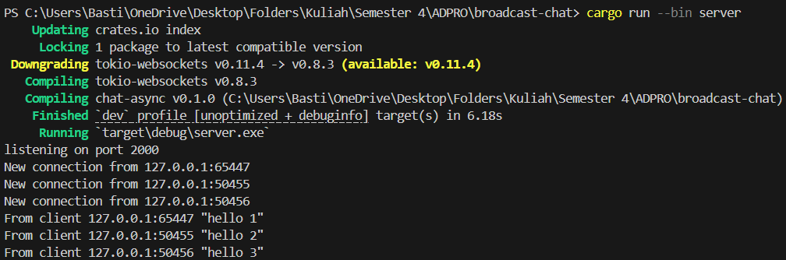
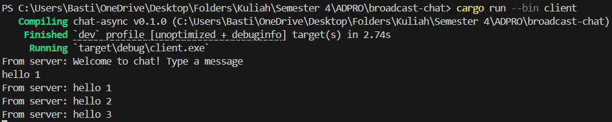
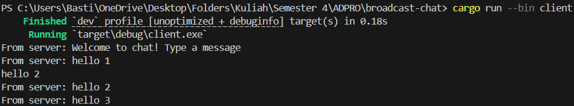
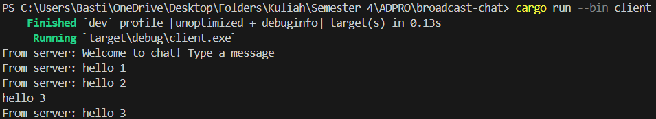
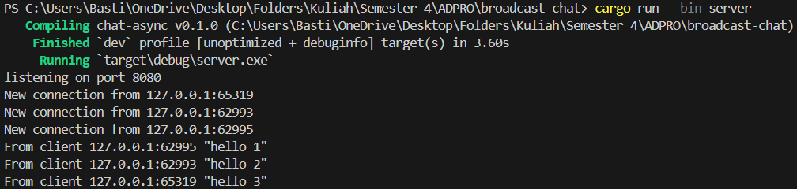
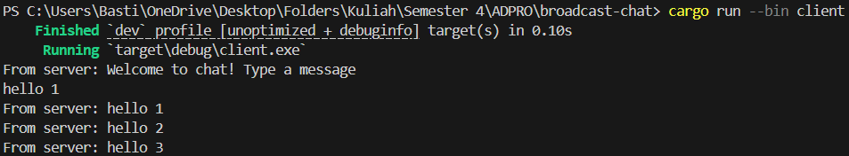
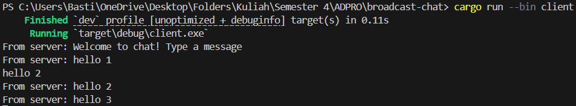
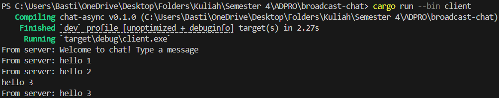

## Original Code of Broadcast Chat.

Saat menjalankan satu server dan tiga client, pesan yang dikirim dari satu client akan di-broadcast ke semua client yang terhubung. Sebagai contoh, ketika client pertama mengetik "hello 1", pesan tersebut akan diterima oleh server kemudian di-broadcast ke semua client (termasuk client pertama sendiri). Hal yang sama terjadi ketika client kedua mengirim "hello 2" dan client ketiga mengirim "hello 3". Setiap client menerima semua pesan yang dikirim dari client manapun, menunjukkan bahwa komunikasi broadcast berfungsi dengan baik. Server juga menampilkan informasi koneksi dan pesan yang diterima untuk keperluan monitoring.

Aplikasi ini mendemonstrasikan penggunaan asynchronous programming di Rust menggunakan Tokio runtime, pengelolaan multiple connections secara concurrent, dan implementasi pola publish-subscribe menggunakan channel untuk broadcast message.

## Modifying the Websocket Port 

Untuk mengubah port yang digunakan pada aplikasi chat ini, diperlukan modifikasi pada dua file yang berbeda karena komunikasi terjadi antara dua sisi: server dan client. Pada file `server.rs`, port diubah pada baris kode `TcpListener::bind("127.0.0.1:8080").await?;`. Sedangkan pada sisi client, modifikasi dilakukan pada file `client.rs` di baris `ClientBuilder::from_uri(Uri::from_static("ws://127.0.0.1:8080"))`. Kedua file tersebut menggunakan protokol WebSocket yang sama, ditunjukkan dengan penggunaan URI dengan skema "ws://" pada client dan implementasi WebSocket server di file server.rs melalui `tokio_websockets` crate. WebSocket protocol memungkinkan komunikasi dua arah (bidirectional) secara real-time antara server dan client, yang merupakan teknologi ideal untuk aplikasi chat.